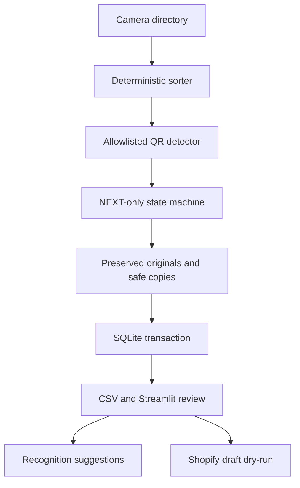

# SnapIMS architecture

## Design rule

SnapIMS treats the camera roll as an ordered event stream. EXIF time restores chronology; it never decides item membership. After a product item begins, every ordinary photograph belongs to it until `CVHS1:ITEM:NEXT` or batch end.

AI recognition and Shopify publishing are downstream services. Neither participates in parsing, identity generation, grouping, or original preservation.

## Components

| Component | Responsibility |
|---|---|
| `snapims/sorter.py` | Discover supported files and order by EXIF original/digitized/general time, subsecond data, filename timestamp, filesystem time, camera sequence, and filename. |
| `snapims/qr.py` / `protocol.py` | Decode QR pixels and accept only the existing Version 2.0 vocabulary. Unknown QR data returns ordinary-photo behavior and never executes. |
| `snapims/interpreter.py` | Deterministic START/END/NEXT state machine, shelf/flag deferral, CONT no-op, exclusions, and warnings. |
| `snapims/processor.py` | Fingerprinting, duplicate checks, backup, staging/resume, original copy, safe JPEG generation, manifests, atomic finalization, and database insert. |
| `snapims/db.py` | Migration runner, schema, foreign-key transactions, inventory events, recognition records, and Shopify checkpoints. |
| `snapims/inventory.py` | Human-facing CSV mapping, immutable Item ID import, validation, and audit export. |
| `snapims/recognition/` | Provider-neutral suggestion contract and mock/OpenAI/Gemini/local-OCR adapters. |
| `snapims/shopify/` | GraphQL transport boundary, remote SKU check, draft creation, variant/inventory/media stages, and retry history. |
| `streamlit_app.py` | Operator workflow with no routine terminal requirement. |

## Parser state and safety

The interpreter tracks batch state, active/deferred shelf, current item, and pending one-item flags.

- Ordinary photos before START or after END are excluded from products, warned, hash-preserved, and audited.
- Duplicate START does not reset state. Duplicate/post-END commands are warned.
- NEXT closes an open item. Consecutive or trailing NEXT commands cannot create empty items.
- END closes the current item.
- A shelf scanned during an item is deferred until the item closes.
- RARE and REVIEW stack and apply to the next item; they reset when that item begins.
- CONT is recorded and warned as a deprecated compatibility no-op.
- Command images are retained in `originals` and `commands`, but are never attached to items.
- Only a parsed allowlisted payload becomes a command event.

## Identity and naming

- Batch: `YYYYMMDD-HHMMSS[-SANITIZED-NAME]`
- Item/SKU: `<BATCH-ID>-<SHELF>-<SEQUENCE>`
- Images: `<ITEM-ID>-F.jpg`, `<ITEM-ID>-02.jpg`, and so on

The source fingerprint is a SHA-256 digest over ordered stream position, file hash, and original filename. Identity and output are deterministic for a given import; a pre-existing Batch ID collision advances the system timestamp safely without overwriting data.

## File safety and resumability

Original files use `shutil.copy2` and are verified against their source SHA-256. Product/command upload copies are oriented, converted to RGB JPEG, and saved without EXIF, which removes GPS from public copies. Work is written to fingerprint-specific staging folders. A progress marker retains the chosen Batch ID across retry. Final folders are installed with atomic renames before one transactional database insert.

An import already committed to SQLite is returned as a duplicate. If files were finalized but the database commit did not occur, the batch manifest is used to recover the missing database record after checking that expected processed files exist.

## Recognition boundary

`BaseRecognizer.recognize(item, images) -> RecognitionResult` returns suggested fields, confidence, uncertainty, provider, raw-response reference, and review requirement. Results are append-only suggestions in `recognition_results`. They do not alter authoritative item fields until an operator accepts them, and accepted results still mark the item for review.

## Shopify boundary

Shopify is simulation-first and draft-only. The service performs local validation and optional read-only duplicate-SKU lookup before any write. Live writes require credentials, `SHOPIFY_DRAFT_ONLY=true`, a deliberate confirmation phrase/checkbox, and an explicit method argument. Each run is backed up and logged in `upload_attempts`; durable IDs/checkpoints live in both `items` and `shopify_sync`.

## Trust boundaries

- `.env` and Streamlit secrets are ignored by Git.
- Original images, databases, logs, exports, and backups are ignored by Git.
- Source paths are operator-selected local directories.
- SQL table browsing uses a fixed application allowlist.
- Shopify credentials are never placed in manifests or logs.
